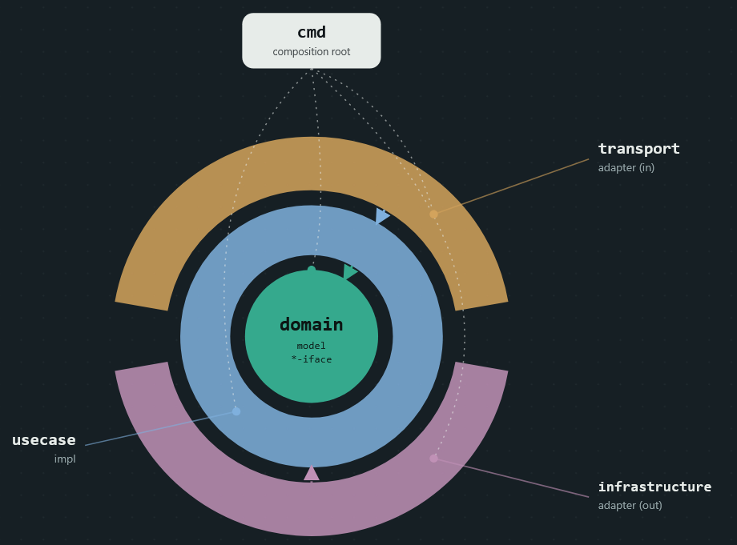

# Архітектура RepoNotifier

Цей документ описує архітектуру системи на високому рівні: з яких сервісів вона
складається, як вони взаємодіють, за якими правилами організований код
усередині кожного сервісу і де шукати деталі та історію рішень.

## Огляд системи

RepoNotifier відстежує релізи GitHub-репозиторіїв і надсилає email-сповіщення
підписникам. Система складається з трьох незалежно розгортаних Go-сервісів,
що спілкуються через RabbitMQ (asynchronous messaging) та gRPC (synchronous
calls), і спільного модуля `shared`.

| Сервіс | Відповідальність | Сховище | Порти |
|---|---|---|---|
| **subscription** | Керує користувачами, підписками, saga підтвердження email; REST (Gin) + gRPC API | PostgreSQL (subscription_db) | HTTP 8080, gRPC 9091 |
| **tracking** | Періодично опитує GitHub API, детектує нові релізи за `last_seen_tag`, тримає денормалізовану копію підписок | PostgreSQL (tracker_db) | HTTP 8081, gRPC 50051 |
| **notification** | Споживає команди з RabbitMQ і надсилає email через SMTP | — (stateless) | HTTP 8082 |

Детальні C4-діаграми (контейнери й компоненти кожного сервісу) — у
[docs/с4](docs/с4/с4.svg). Пронумеровані рішення та їх обґрунтування — у
[docs/adr](docs/adr/).

## Чому саме так

- **Кожен сервіс — окремий deployable unit** зі своєю БД: `subscription` і
  `tracking` не діляться таблицями і не звертаються напряму до чужої БД —
  тільки через RabbitMQ або gRPC. Це дозволяє масштабувати й деплоїти сервіси
  незалежно.
- **Outbox pattern** (`internal/infrastructure/outbox` в subscription і
  tracking) гарантує, що подія публікується в RabbitMQ тоді і тільки тоді,
  коли відповідна зміна закомічена в БД — уникаємо втрати повідомлень при
  падінні між записом у БД і публікацією в чергу.
- **Saga** (`services/subscription/internal/saga`) не чекає, поки
  користувач перейде за посиланням у листі, — це окремий синхронний крок
  (`UserUseCase.Confirm` по токену). Сага координує лише надійну *відправку*
  листа з підтвердженням: після `Subscribe` вона кладе в outbox команду
  надіслати лист і чекає на подію-результат від `notification`-сервіса; якщо
  відправка не вдалась — компенсує, видаляючи ще не підтверджену підписку.
- **Clean Architecture всередині кожного сервісу** ([ADR-0002](docs/adr/0002-use-clean-architecture.md))
  ізолює бізнес-логіку від фреймворків і інфраструктури, щоби DB, HTTP-шар чи
  зовнішні API можна було замінити, не чіпаючи usecase.
- Система стартувала як моноліт ([ADR-0001](docs/adr/0001-use-monolith.md)) і
  згодом виокремилась у три сервіси в міру росту потреб у незалежному
  масштабуванні (worker/scanner проти API проти email sender).

## Внутрішня структура сервіса

Всі три сервіси (`services/subscription`, `services/tracking`,
`services/notification`) дотримуються однієї шаруватої структури. Напрямок
залежностей — завжди всередину, до `domain`:

- **domain** — сутності (`model`), інтерфейси репозиторіїв/сервісів/usecase.
  Не залежить ні від чого (`mayDependOn: []`).
- **usecase** — бізнес-логіка. Залежить лише від `domain`-інтерфейсів, не
  знає про HTTP, gRPC, конкретну БД чи брокер.
- **infrastructure / repository** — реалізації інтерфейсів `domain`: доступ
  до Postgres, Redis, RabbitMQ, GitHub API, outbox relay.
- **transport** — вхідні адаптери: HTTP (Gin), gRPC, обробники повідомлень
  з брокера. Викликають `usecase` через його інтерфейс.
- **cmd** — точка входу, єдине місце, якому дозволено знати про все
  (`anyProjectDeps: true`).

Ці правила залежностей не просто описані тут — вони **автоматично
перевіряються** [go-arch-lint](https://github.com/fe3dback/go-arch-lint) за
конфігами `.go-arch-lint.yml` у корені кожного сервіса та в `shared/`, і
запускаються в CI. Порушення межі шару ламає збірку, а не залишається
непоміченим коментарем у коді.

## Спільний код (`shared/`)

Модуль `shared` підключається усіма трьома сервісами як окремий Go-модуль
(див. `go.work`) і містить тільки те, що дійсно однакове для всіх:

- `shared/domain` — спільні доменні моделі/кеш-абстракції;
- `shared/infrastructure` — broker (RabbitMQ), cache (Redis), storage,
  grpc-обгортки, metrics;
- `shared/config`, `shared/ctxlog`, `shared/contracts` (gRPC/proto контракти).

`shared/domain` не залежить ні від чого, `shared/infrastructure` може
залежати лише від `domain` і `config` — ті самі принципи Clean Architecture
застосовані на рівні спільного модуля.