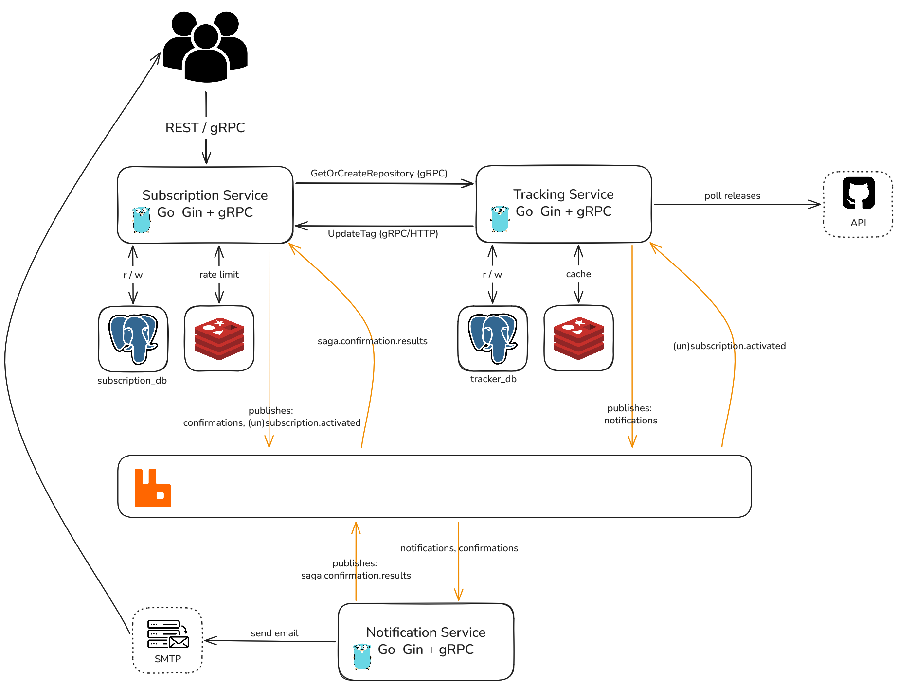

# RepoNotifier
 
> Go system that tracks GitHub repository releases and sends real-time email notifications to subscribers. Built as three independently deployable services communicating over gRPC and RabbitMQ.
 
[](https://codecov.io/gh/ReilEgor/NotifierTest)

 
---

## Table of Contents
 
- [Overview](#overview)
- [How It Works](#how-it-works)
- [Features](#features)
- [Architecture](#architecture)
- [Quick Start](#quick-start)
- [Configuration](#configuration)
- [API Reference](#api-reference)
- [Testing](#testing)
- [Observability](#observability)
- [Tech Stack](#tech-stack)
- [Contributing](#contributing)
 
---

## Overview
 
RepoNotifier continuously monitors GitHub repositories and notifies users when new releases are published. It is split into three services - **subscription**, **tracking**, and **notification** - each with Clean Architecture internals, resilience patterns, and observability built in. See [ARCHITECTURE.md](ARCHITECTURE.md) for the full breakdown and [docs/adr](docs/adr/) for the reasoning behind each major decision.
 
---

## How It Works

1. **Subscribe** - a user submits an email + repo via the subscription service's REST/gRPC API. Subscription resolves the repo through a gRPC call to tracking (registering it there if unseen), saves a pending subscription, and starts a **saga** that queues a confirmation command via the outbox pattern.
2. **Confirm** - an outbox relay publishes the command to RabbitMQ; the notification service emails the confirmation link over SMTP and reports success/failure back as a saga reply. A failure compensates by rolling back the pending subscription; success leaves the saga waiting for the user to click the link.
3. **Activate** - clicking the link marks the subscription confirmed and emits a `SubscriptionActivatedEvent`; tracking consumes it and upserts the subscriber into its own local subscriber list.
4. **Scan** - tracking polls the GitHub API for every tracked repository on a timer, comparing the latest tag against the stored `last_seen_tag`.
5. **Detect & Publish** - on a new tag, tracking updates the repo record, queues a notification command per subscriber through its own outbox, and reports the new tag back to subscription (gRPC/HTTP) to keep its cached copy in sync.
6. **Notify** - the notification service consumes the queue and emails matching subscribers via SMTP.

Each service runs its own outbox relay, so events only cross service boundaries after being durably committed in the same transaction as the state change.
 
---

## Features
 
| Feature | Description |
|---|---|
| 🔔 Automated tracking | Background scanner detects new releases using `last_seen_tag` strategy |
| 📫 Email notifications | Instant alerts via SMTP - compatible with Mailtrap, SendGrid, Gmail |
| 🛡 Rate limit handling | Graceful handling of GitHub API `429 Too Many Requests` |
| ⚡ Caching layer | Redis caching reduces redundant API calls and prevents duplicate emails |
| 🌐 Dual interface | REST API (Gin) + gRPC support |
| 📨 Async messaging | RabbitMQ + outbox pattern for reliable event delivery between services |
| 🔥 Resilience patterns | Circuit Breaker (gobreaker), retry strategy, graceful shutdown |
| 📊 Observability | Prometheus metrics, Grafana dashboards, ELK log aggregation |
| 🔐 API key auth | All sensitive endpoints require `X-API-Key` header |
| 🧱 Clean Architecture | Decoupled layers per service, enforced in CI via go-arch-lint |
 
---

## Architecture

RepoNotifier is split into three independently deployable Go services, each with its own database, plus a shared `shared/` module for common infrastructure code. Full details, diagrams, and the "why" behind each decision live in [ARCHITECTURE.md](ARCHITECTURE.md).

| Service | Responsibility | Storage | Ports |
|---|---|---|---|
| **subscription** | Manages users/subscriptions, confirmation saga; REST (Gin) + gRPC API | PostgreSQL (`subscription_db`) | HTTP `8080`, gRPC `9091` |
| **tracking** | Polls GitHub API, detects new releases via `last_seen_tag`, gRPC API | PostgreSQL (`tracker_db`) | health/metrics `8081`, gRPC `50051` |
| **notification** | Consumes RabbitMQ commands and sends email via SMTP | stateless | health/metrics `8082` |


---
 
## Quick Start
 
> [!IMPORTANT]
> Complete the env configuration before starting the app. Without valid credentials, the email and GitHub API integrations will fail.
 
```bash
# Clone the repository
git clone https://github.com/GenesisEducationKyiv/software-engineering-school-6-0-ReilEgor.git
cd software-engineering-school-6-0-ReilEgor
 
# Copy and fill in environment variables:
# - deployments/.env holds shared/infra values (DB, Redis, RabbitMQ, ports)
# - deployments/env/*.env holds per-service config (subscription, tracking, notification)
cp deployments/.env.example deployments/.env
cp deployments/env/subscription.env.example deployments/env/subscription.env
cp deployments/env/tracking.env.example deployments/env/tracking.env
cp deployments/env/notification.env.example deployments/env/notification.env
# Edit the copied files - see Configuration section below
 
# Build and start all services
docker compose --profile observability --profile docs -f deployments/docker-compose.yml up --build
```
 
Once running, verify the services are healthy:
 
| Service | URL |
|---|---|
| Subscription REST API | http://localhost:8080 |
| Tracking health/metrics | http://localhost:8081/health |
| Notification health/metrics | http://localhost:8082/health |
| Swagger UI | http://localhost:9080 |
| RabbitMQ management | http://localhost:15672 |
| Prometheus | http://localhost:9090 |
| Grafana | http://localhost:3030 |
| Kibana | http://localhost:5601 |
 
---
 
## Configuration
 
Env files live under `deployments/`: `.env` for shared/infra values, `env/subscription.env`, `env/tracking.env` and `env/notification.env` for each service's own config. Edit them with your credentials before starting:
 
| Variable | File | Required | Description |
|---|---|---|---|
| `APP_API_KEY` | `env/subscription.env`, `env/tracking.env` | **Required** | Secret key for `X-API-Key` authentication. All protected endpoints reject requests without this. |
| `GITHUB_TOKEN` | `env/tracking.env` | **Required** | GitHub personal access token used to poll the releases API. |
| `EMAIL_USER` | `env/notification.env` | **Required** | SMTP sender address (e.g. `you@gmail.com`). |
| `EMAIL_PASSWORD` | `env/notification.env` | **Required** | SMTP app password - not your account login password. |
| `RABBITMQ_USER` / `RABBITMQ_PASSWORD` | `.env` | **Required** | Credentials for the shared RabbitMQ broker. |
| `APP_HTTP_PORT` | `.env` | Optional | Port for the subscription REST API. Default: `8080`. |
| `APP_GRPC_PORT` | `.env` | Optional | Port for the subscription gRPC server. Default: `9091`. |
| `TRACKING_GRPC_PORT` | `.env` | Optional | Port for the tracking gRPC server. Default: `50051`. |
| `WORKER_HEALTH_PORT` / `SENDER_HEALTH_PORT` | `.env` | Optional | Health/metrics ports for tracking and notification. Defaults: `8081` / `8082`. |
 
> **Gmail users**: generate an [App Password](https://myaccount.google.com/apppasswords) - standard account passwords are rejected by Gmail SMTP.
 
---
 
## Testing

Unit tests, integration tests (Testcontainers), architecture-boundary checks (go-arch-lint), and E2E tests (Playwright) are all documented in [testing.md](testing.md).
 
---

## Observability
 
Each service exposes Prometheus metrics at `/metrics` (subscription on `8080`, tracking on `8081`, notification on `8082`) and structured logs shipped to Elasticsearch via Fluent Bit. Grafana and Kibana dashboards cover:
 
- GitHub API request rate and error rate
- Email delivery success/failure
- Background scanner cycle duration
- Circuit breaker state transitions
- Redis cache hit/miss ratio
- Centralized service logs (Kibana)

```bash
# Core only
docker compose -f deployments/docker-compose.yml up -d

# With monitoring (Prometheus, Grafana, ELK)
docker compose -f deployments/docker-compose.yml --profile observability up -d

# With API documentation (Swagger UI)
docker compose -f deployments/docker-compose.yml --profile docs up -d

# All at once
docker compose -f deployments/docker-compose.yml --profile observability --profile docs up -d
```

---
 
## Tech Stack
 
| Layer | Technology |
|---|---|
| Language | Go 1.25+ |
| HTTP framework | Gin |
| RPC | gRPC (google.golang.org/grpc) |
| Message broker | RabbitMQ |
| Database | PostgreSQL |
| Cache | Redis |
| Resilience | gobreaker (Circuit Breaker) |
| Metrics | Prometheus |
| Dashboards | Grafana |
| Logs | Fluent Bit + Elasticsearch + Kibana |
| API docs | Swagger / OpenAPI |
| Architecture linting | go-arch-lint |
| Infrastructure | Docker, Docker Compose |
| External API | GitHub REST API |
 
---
 
## Contributing
 
Contributions, bug reports, and feature requests are welcome.
 
1. Fork the repository
2. Create a feature branch: `git checkout -b feat/your-feature`
3. Commit your changes: `git commit -m 'feat: add your feature'`
4. Push and open a pull request
 
Please follow the existing code style, keep changes within their service's architecture boundaries (`go-arch-lint check`), and add tests for any new functionality.
