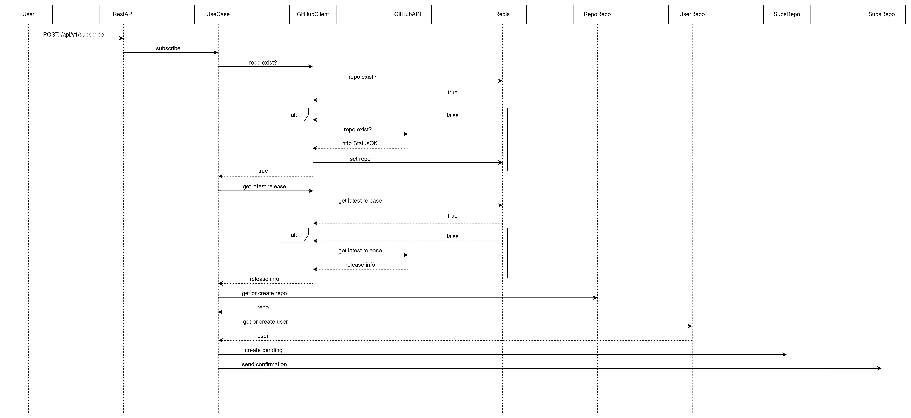
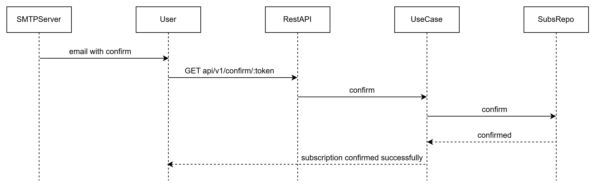
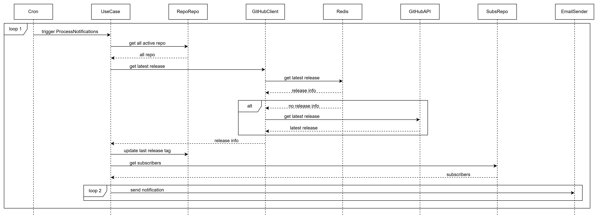
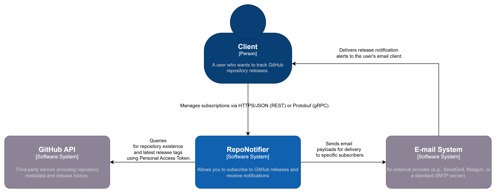
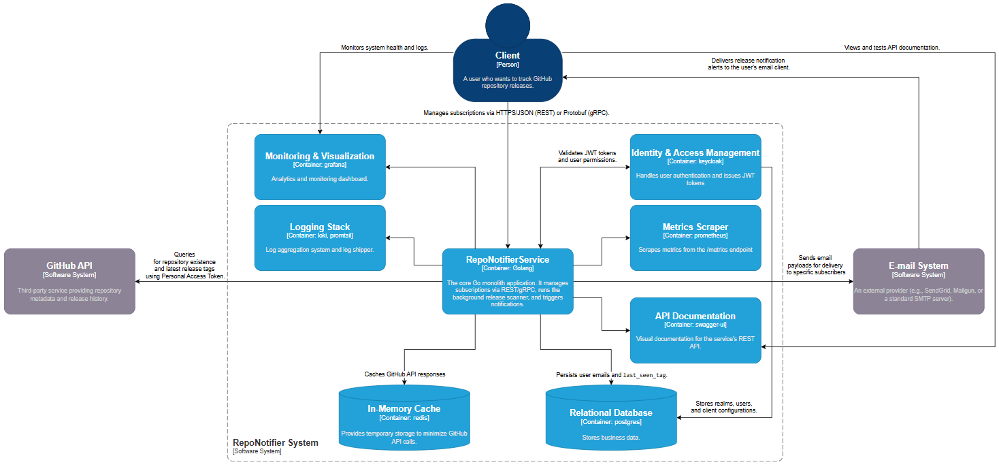
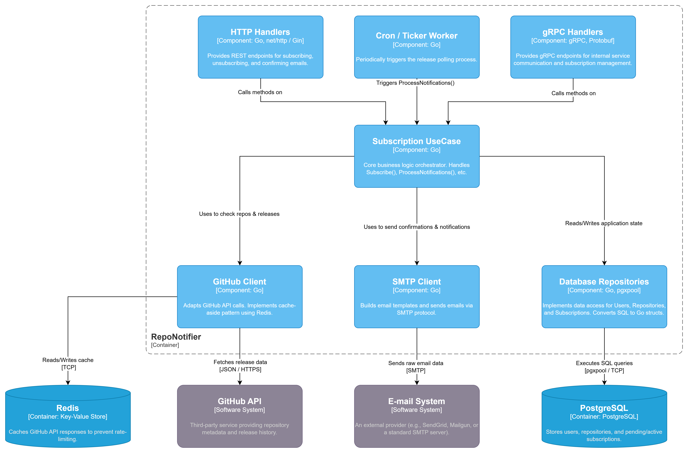
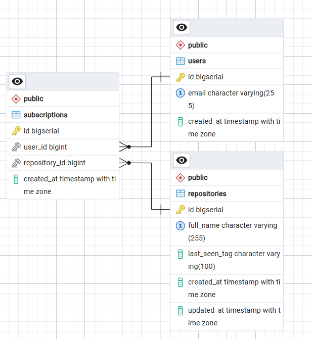

# System Design: GitHub Repository Notifier

## 1. System requirements:

### Functional requirements:

- Subscription Management: The user can subscribe to notifications about new releases for any public repository on GitHub by specifying their email address and the repository name (in the owner/repo format).
- Verification (Double Opt-In): The system must send an email with a unique link (UUID token) to confirm ownership of the email address before activating the subscription.
- Unsubscribe: Each notification email must contain a unique link for instantly unsubscribing from a specific repository.
- Release Tracking: The system must check for new releases (tags) in the background (on a schedule) for all repositories tracked by the database.
- Notification Dispatch: When a new release is detected, the system must generate and send an email notification to all confirmed subscribers of the repository.

### Non-functional requirements:

- Observability: The system should support metric collection (Prometheus) and structured logging (slog + Promtail + Loki) for health monitoring and anomaly detection via Grafana dashboards.
- Concurrency & Resource Control: Email distribution should be performed in parallel, but with strict worker pool restrictions (e.g., via a limited errgroup) to prevent server resource exhaustion (CPU/RAM) and network ports.
- Fault Tolerance: All network requests to external providers (GitHub API, SMTP server) should be limited by timeouts (context.WithTimeout) to prevent a third-party service crash from blocking the entire application. 
- Maintainability: The codebase must strictly adhere to the principles of Clean Architecture (separation into Delivery, UseCase, and Repository), utilize Dependency Injection for easy component replacement, and be covered by unit tests (using mocks for external dependencies).
- Data Integrity: Database access (PostgreSQL) must be performed through a connection pool (pgxpool) to ensure safe concurrent query processing.
- Scalability: The system should support horizontal scaling of API servers and background workers independently without service interruption.
- Availability: The system should remain operational even if individual external dependencies (GitHub API, SMTP provider, Redis) become temporarily unavailable.
- Target API availability: 99.9%
- Extensibility: The architecture should allow replacing infrastructure components (SMTP provider, cache, database, GitHub provider) with minimal changes to business logic.

### Limitations:

- No Webhooks (Polling Model): Since the service allows monitoring of any public repositories, the application does not have administrative rights to configure GitHub Webhooks. Because of this, the system is limited to the Polling model (periodic polling), which means a delay between the actual release and the notification being sent.
- GitHub API Rate Limits: GitHub has strict limits on the number of requests per hour from a single IP/token. This limitation requires the mandatory use of caching (Redis) to avoid repeated requests for the same repository within a short period of time.
- SMTP Provider Constraints: Mail services impose rate limits on email sending and may consider sudden traffic spikes as spam. This limits the maximum throughput and requires load monitoring at the sending stage.

## 2. Load Assessment:

### Users and Traffic:

- Inbound Traffic (User API): The incoming HTTP traffic from users is extremely low. Assuming 1,000 Daily Active Users (DAU) making 2-3 requests (subscribe, confirm, unsubscribe), the load is approximately ~3,000 requests/day (0.035 RPS). This places negligible load on the HTTP delivery layer.
- Outbound Traffic (Polling System): This is the primary source of continuous load. To check 2,000 unique repositories with a polling interval of 1 minute, the system executes ~120,000 outbound requests per hour (~33.3 RPS) to the GitHub API.
- Notification Spikes (Fan-out): Traffic is "bursty". If a popular repository (e.g., golang/go) with 1,000 subscribers releases a new version, the system will generate a sudden spike of 1,000 outbound SMTP requests. This is mitigated by bounded concurrency (errgroup.SetLimit).

### Data:

- Relational Storage (PostgreSQL): Storage requirements for business logic are minimal.
- Users Table: ~100 bytes/record. 10,000 users = ~1 MB.
- Repositories Table: ~150 bytes/record. 2,000 repos = ~300 KB
- Subscriptions Table: ~150 bytes/record. 10,000 subs = ~1.5 MB.
- Total DB Size: < 5 MB, which is negligible for PostgreSQL.
- Total DB size (including B-tree indexes) is expected to be under 50 MB.
- Cache (Redis): Caching GitHub API responses to prevent rate-limiting. ~2 KB per cached JSON response. 2,000 repos = ~4 MB of RAM.
- Observability (Loki/Prometheus): Telemetry and structured logs will consume the most disk space. Estimated at ~500 MB to 1 GB per day depending on the log level. Requires a 7-14 day retention policy to prevent disk exhaustion.

### Bandwidth:

- Inbound Bandwidth: Negligible (JSON payloads for HTTP requests are < 1 KB each).
- Outbound Bandwidth (GitHub API): 8,000 requests/hour * ~5 KB (average GitHub Release JSON size) ≈ 40 MB/hour (~1 GB/day).
- Outbound Bandwidth (SMTP): Average email size using the plaintext template is ~1 KB. A spike of 1,000 emails requires only ~1 MB of bandwidth.
- Summary: A basic cloud instance (e.g., AWS t3.micro) with a standard network interface (up to 5 Gbps) is vastly over-provisioned for this network load, guaranteeing stable performance.

## 3. System Architecture:

### Sequence Diagram:

#### Subscription Flow:

#### Subscription Confirm Flow:

#### New Release Notification Flow (every 1 minute):

### C4 diagrams:

### lvl 1:

### lvl 2:

### lvl 3:

### Entity-Relationship diagram:

## 4. Detailed Design of Components:

## API Layer:

### Responsibility:

The API layer acts as the primary entry point for external client interactions. In accordance with Clean Architecture principles, this layer is strictly isolated from business logic. Its core responsibilities include:
1) Request Parsing & Validation: Extracting payloads (JSON) and URL parameters, and performing initial syntax validation (e.g., checking if the email format is correct and fields are not empty).
2) Routing: Directing incoming HTTP requests to the appropriate handler functions.
3) Delegation: Passing sanitized and validated data to the underlying SubscriptionUseCase for business processing.
4) Observability Integration: Exposing endpoints for infrastructure monitoring (e.g., Prometheus metrics, health checks).

### Endpoints:
- Endpoint: POST /api/v1/subscribe (Create a pending subscription and send a confirmation email.)
- Endpoint: GET /api/v1/confirm/:token (Confirm a pending subscription using the token sent via email.)
- Endpoint: GET /api/v1/unsubscribe/:token (Remove a subscription using a unique token.)
- Endpoint: GET /api/v1/subscriptions (Retrieve a list of all confirmed subscriptions for a given email.)
- Endpoint: GET /health